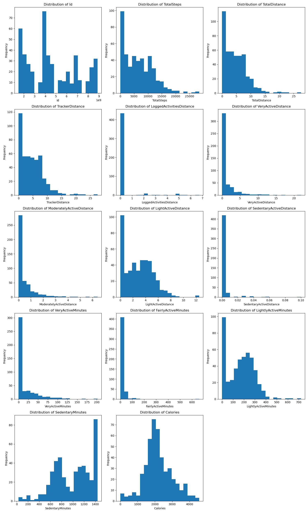
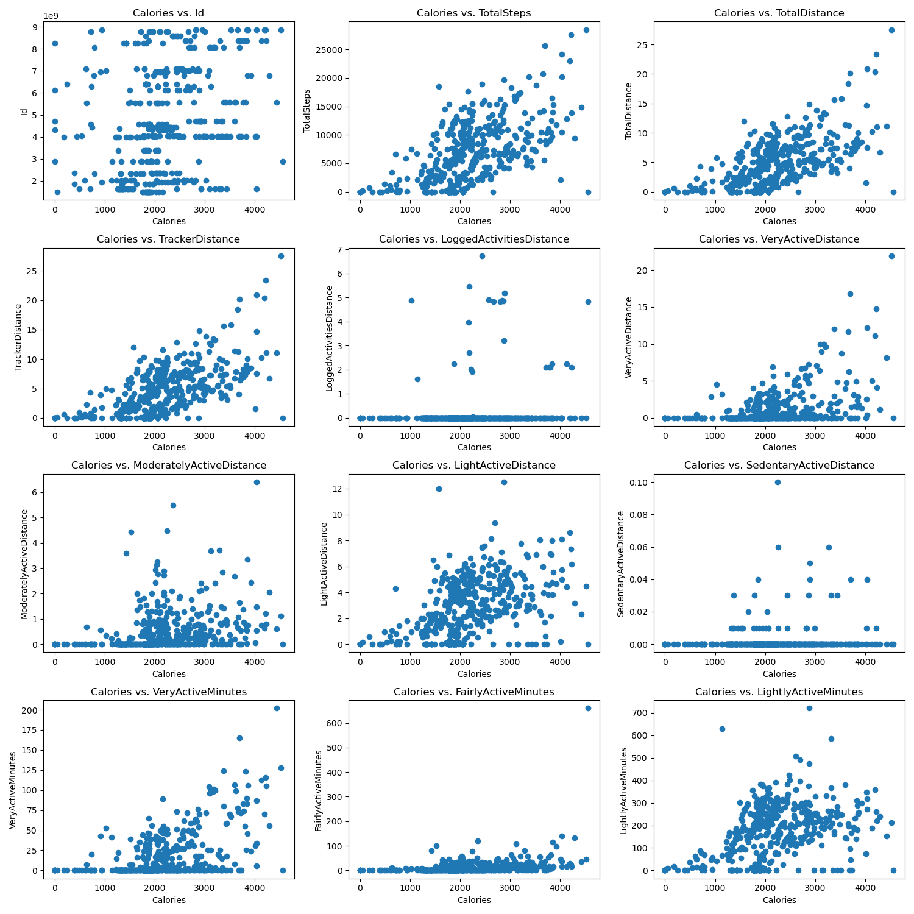
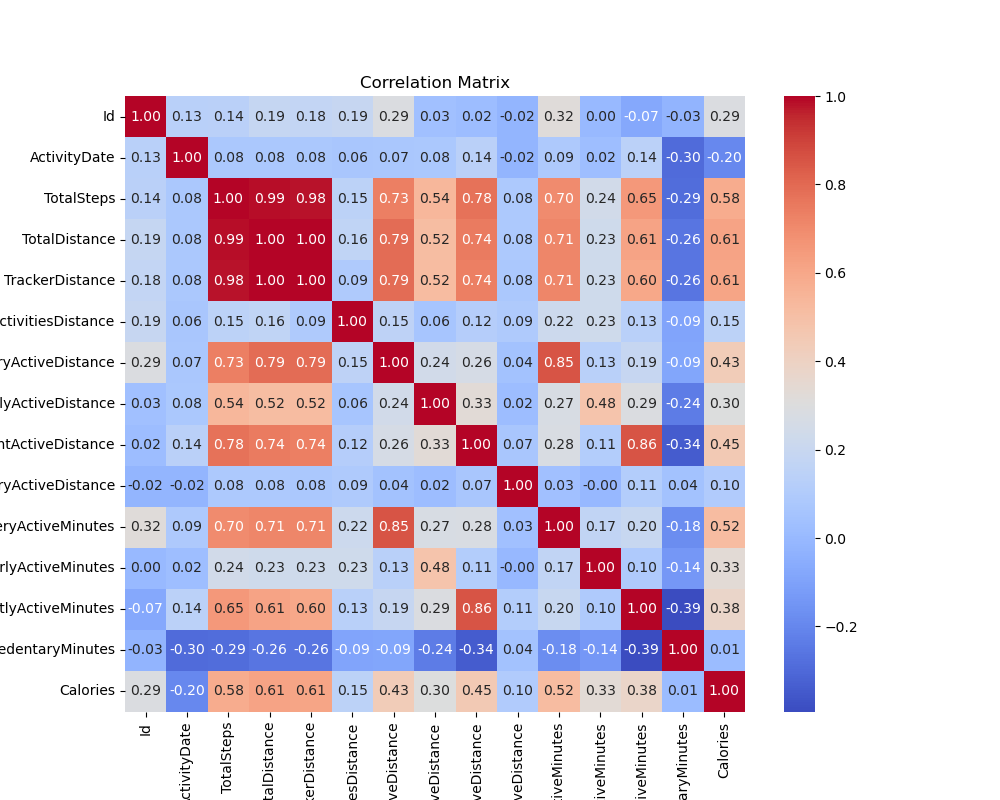

# Final Capstone Project

 **Change in the project:** 
Final capstone project has been changed since it was first proposed during first meeting with the TA. Initially, I was intended to do Recommendation system. However, one of the module was fully based on Recommendation system and most of the work I was planning to do was covered in the class module itself. 

Inorder to gain more experience in model building, I have opted for weight loss analysis. This project is directly related to the area of work as the current company.  I could use this learning to build better models in the existing Fitness app.

 **URL for the assignment:** 
```
https://github.com/hegdesan-us/final_project.git
```
 **URL for solution Jupyter notebook:** 
```
https://github.com/hegdesan-us/final_project/blob/b07d33eadcea61195ca01e592fbc36aca516d1a6/Final_Capstone.ipynb
```

**Name :** Sanjay Hegde \
**Couse :** UCB AI/ML 

**Directory :** Images \
  Description : Contains the images needed for the prompt questions and the Jupyter notebook 

**Directory : data** \
 Description : Contains the data file needed for the class project\
 Contains file : dailyActivity_merged.csv

### Data Preperation
 **Not much missing values**

 


## Exploratory Data Analysis (EDA)

**From the bivariate analysis**
- Clearly there are some zero values for Total Distance and Calories which we will need to clean up (i.e., remove) in data prep
- Concentration of users with total distance between 3 to 15 miles and Calories between 1000 to 4000
- Few outliers over 20 miles but still with Calories between 1000 to 4000. Although a couple over 25 miles with Calories over 4000
- Limited records with Total Distance over 25k miles and Calories over 4000##
- Strong correlation between Total Steps taken and Distance. As the TotalDistance increases, the TotalSteps also increase showing a linear relationship between the two features.
- Interesting observations with folks logging zero active minutes but recording values for Total Distance. Maybe Fitbit not working and bad data. These are  candidates to be removed during data preparation (i.e., remove records where Very Active Minutes is zero)
- We have 33 unique users in the dataset recording their activities over a number of days. Max no of days for some records is 31 days (i.e., one month) Let's explore one user and visualize their activities over that one month period.

**From the heatmap:**
- Strong correlation between Total Distance and Tracker Distance. Very Active Distance also shows a strong correlation with Total Distance and Tracker Distance features.

- However, there is weak correlation across the board between the computed weight loss features and the other features.


**From univariate analysis**
- LoggedActivitiesDistance, VeryActiveDistance, ModeratelyActiveDistance, LightActiveDistance and SedentaryActiveDistance may not be valuable for modelling. We can remove them
- There are some rows with Calories = zero and Total Distance = zero as these records are not useful


<h2> Visualizations</h2>

**Univariate Data Analysis**

 


**Bivariate Data Analysis**

 


**Correlation Heatmap**


 

 
## Major features for the Machine Learning Models SelectKBest feature selection
- Feature selection based on SelectKBest gives following top features
- [ID, TotalSteps, TotalDistance, TrackerDistance, VeryActiveMinutes, FairlyActiveMinutes, LightlyActiveMinutes, SedentaryMunites ]

## Model performance comparision
Now, we aim to compare the performance of the Logistic Regression model to our KNN algorithm, Decision Tree, and SVM models.  Using the default settings for each of the models, fit and score each.  Also, be sure to compare the fit time of each of the models.  Present your findings in a `DataFrame` similar to that below: 


| __Machine Learning Models__| __Train Time (sec)__| __Train Accuracy__|__Test Accuracy__|
| :-:| :-:| :-:|:-:| 
|  Lin Reg    | 0.002 |0.54    |0.50    |
|  KNN   | 0.004 |0.55    |0.31    |  
|  DTree   |  0.02 |1.0    |0.37    |  
|  GB   | 0.05|0.95    |0.78    |  
|  RF   |  0.32 |1.0    |0.67   |  

## Model performance comparision after Hyper Parameter Tuning
Now, we aim to compare the performance of the Logistic Regression model to our KNN algorithm, Decision Tree, and SVM models.  Using the default settings for each of the models, fit and score each.  Also, be sure to compare the fit time of each of the models.  Present your findings in a `DataFrame` similar to that below: 

- GradientBoosting with max_depth=3 and n_estimators=200 seems optimal interms of Test accuracy


| __Machine Learning Models__| __Train Time (sec)__| __Train Accuracy__|__Test Accuracy__|
| :-:| :-:| :-:|:-:| 
|  Lin Reg    | 0.002 |0.54    |0.50    |
|  KNN   | 0.0004 |1    |0.75   |  
|  DTree   |  0.01 |0.28    |0.29    |  
|  GB   | 0.1|0.98    |0.83   |  
|  RF   |  0.13 |0.99    |0.67   |  

## Next steps

Current model has ~83% accurate in predicting the weight loss based on calories. This is indeed low. It is possible to increase the accuracy with additional data to train.
In addition, this model can be used in any of the fitness app to predict the calories burned. In addition to the current feature selection, it is good to collect additional data about food intake ( similar to myfitnesspal etc), these additional signals can be used to build better preduction model. In addition, I would recommend collecting daily weight so that we can use that instead of calories for prediction. 

 

 
