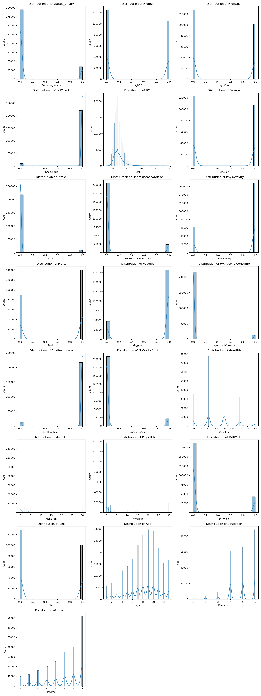
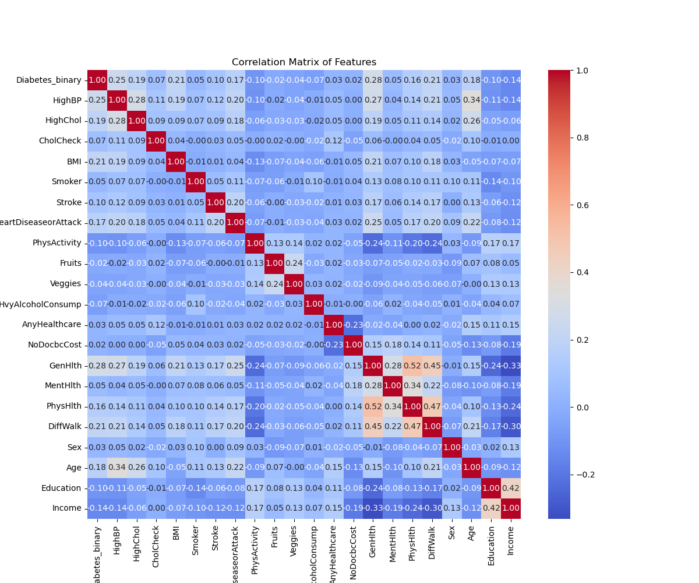

# Final Capstone Project

 **Change in the project:** 
Final capstone project has been changed since it was first proposed during first meeting with the TA. Initially, I was intended to do Recommendation system. However, one of the module was fully based on Recommendation system and most of the work I was planning to do was covered in the class module itself. 

Inorder to gain more experience in model building, I have opted for weight loss analysis. This project is directly related to the area of work as the current company.  I could use this learning to build better models in the existing Fitness app. However, data source (https://www.kaggle.com/datasets/arashnic/fitbit/data) contained very limited data and models were not really predictable. Inorder for better accuracy, it needed additional data. 

Finally, ended up with Health Analysis. This project was related to the health industry and the data source had good amount of data for the model building. 


**Why this Research is important:** 
Context
Diabetes is among the most prevalent chronic diseases in the United States, impacting millions of Americans each year and exerting a significant financial burden on the economy. Diabetes is a serious chronic disease in which individuals lose the ability to effectively regulate levels of glucose in the blood, and can lead to reduced quality of life and life expectancy. After different foods are broken down into sugars during digestion, the sugars are then released into the bloodstream. This signals the pancreas to release insulin. Insulin helps enable cells within the body to use those sugars in the bloodstream for energy. Diabetes is generally characterized by either the body not making enough insulin or being unable to use the insulin that is made as effectively as needed.

Complications like heart disease, vision loss, lower-limb amputation, and kidney disease are associated with chronically high levels of sugar remaining in the bloodstream for those with diabetes. While there is no cure for diabetes, strategies like losing weight, eating healthily, being active, and receiving medical treatments can mitigate the harms of this disease in many patients. Early diagnosis can lead to lifestyle changes and more effective treatment, making predictive models for diabetes risk important tools for public and public health officials.

The scale of this problem is also important to recognize. The Centers for Disease Control and Prevention has indicated that as of 2018, 34.2 million Americans have diabetes and 88 million have prediabetes. Furthermore, the CDC estimates that 1 in 5 diabetics, and roughly 8 in 10 prediabetics are unaware of their risk. While there are different types of diabetes, type II diabetes is the most common form and its prevalence varies by age, education, income, location, race, and other social determinants of health. Much of the burden of the disease falls on those of lower socioeconomic status as well. Diabetes also places a massive burden on the economy, with diagnosed diabetes costs of roughly $327 billion dollars and total costs with undiagnosed diabetes and prediabetes approaching $400 billion dollars annually.

 **Research question:** 
Explore some of the following research questions:

- Can we provide accurate predictions of whether an individual has diabetes?
- What risk factors are most predictive of diabetes risk?
- Can we use a subset of the risk factors to accurately predict whether an individual has diabetes?


**Data Sources:**

Dataset used in this EDA is from UC Irvine Machine Learning Repository which can be accessed from this link: https://archive.ics.uci.edu/dataset/891/cdc+diabetes+health+indicators


 **URL for the assignment:** 
```
https://github.com/hegdesan-us/final_project.git
```
 **URL for solution Jupyter notebook:** 
```
https://github.com/hegdesan-us/final_project/blob/b07d33eadcea61195ca01e592fbc36aca516d1a6/Final_Capstone.ipynb
```

**Name :** Sanjay Hegde \
**Couse :** UCB AI/ML 

**Directory :** Images \
  Description : Contains the images needed for the prompt questions and the Jupyter notebook 

**Directory : data** \
 Description : Contains the data file needed for the class project\
 iabetes _ 012 _ health _ indicators _ BRFSS2015.csv is a clean dataset of 253,680 survey responses to the CDC's BRFSS2015. The target variable Diabetes_012 has 3 classes. 0 is for no diabetes or only during pregnancy, 1 is for prediabetes, and 2 is for diabetes. There is class imbalance in this dataset. This dataset has 21 feature variables


### Data Preperation
 **Not much missing values**

 


## Exploratory Data Analysis (EDA)

**From the bivariate analysis**
- Clearly there are some zero values for Total Distance and Calories which we will need to clean up (i.e., remove) in data prep
- Concentration of users with total distance between 3 to 15 miles and Calories between 1000 to 4000
- Few outliers over 20 miles but still with Calories between 1000 to 4000. Although a couple over 25 miles with Calories over 4000
- Limited records with Total Distance over 25k miles and Calories over 4000##
- Strong correlation between Total Steps taken and Distance. As the TotalDistance increases, the TotalSteps also increase showing a linear relationship between the two features.
- Interesting observations with folks logging zero active minutes but recording values for Total Distance. Maybe Fitbit not working and bad data. These are  candidates to be removed during data preparation (i.e., remove records where Very Active Minutes is zero)
- We have 33 unique users in the dataset recording their activities over a number of days. Max no of days for some records is 31 days (i.e., one month) Let's explore one user and visualize their activities over that one month period.

**From the heatmap:**
- Strong correlation between Total Distance and Tracker Distance. Very Active Distance also shows a strong correlation with Total Distance and Tracker Distance features.

- However, there is weak correlation across the board between the computed weight loss features and the other features.


**From univariate analysis**
- LoggedActivitiesDistance, VeryActiveDistance, ModeratelyActiveDistance, LightActiveDistance and SedentaryActiveDistance may not be valuable for modelling. We can remove them
- There are some rows with Calories = zero and Total Distance = zero as these records are not useful


<h2> Visualizations</h2>

**Univariate Data Analysis**

 


**Bivariate Data Analysis**

 


**Correlation Heatmap**


 

 
## Major features for the Machine Learning Models SelectKBest feature selection
- Feature selection based on SelectKBest gives following top features
- ['HighBP', 'HighChol', 'BMI', 'HeartDiseaseorAttack', 'GenHlth', 'PhysHlth', 'DiffWalk', 'Age', 'Education', 'Income']

## Model performance comparision
Now, we aim to compare the performance of the Logistic Regression model to our KNN algorithm, Decision Tree, and SVM models.  Using the default settings for each of the models, fit and score each.  Also, be sure to compare the fit time of each of the models.  Present your findings in a `DataFrame` similar to that below: 

|__Model__ |	__Train Accuracy__	|__Test Accuracy__|	__Train Time__	|__Precision__|	__Recall__|
| Dummy Classifier|	0.500303	| 0.498786	| 0.012156	| 0.498786	| 1.0 |
|	Logistic Regression |	0.736945	|0.735772	|4.315663|	0.724329	|0.760078|
|	KNN	0.868493 |	0.818395 |	1.051266|	0.770352|	0.906520|
|	Decision Tree |	0.971351 |	0.864027|	2.525716|	0.872649|	0.852013|
|	Gradient Boosting |	0.852442 |	0.852156|	54.575802|	0.856476|	0.845599|
|	Random Forest |	0.971344 |	0.891590|	51.920912|	0.913429|	0.864841|
 

## Model performance comparision after Hyper Parameter Tuning
precision focuses on minimizing false positives (incorrectly identifying a healthy individual as having a condition), while recall prioritizes identifying all actual cases (minimizing false negatives, or missing real cases). For this analysis, we focus on precision. GradientBoosting with learning_rate': 1, 'n_estimators': 200 has the precision of 95%. However, it is computationally intensive. 


|__Model__	| __Train Accuracy__	|__Test Accuracy__	|__Train Time__|	__Precision__|	__Recall__|	__Best Parameters__|
|	Logistic Regression |	0.736633	| 0.735823 |	19.083284	| 0.723632	| 0.761881	| {'C': 1, 'penalty': 'l2'}|
|	KNN	0.969229 |	0.844002 |	73.374831 |	0.811270 |	0.896010m |	{'n_neighbors': 3, 'weights': 'distance'}|
|	Decision Tree |	0.951193 |	0.867101 |	26.319885 |	0.886918 |	0.841065 |	{'max_depth': None, 'min_samples_split': 5}|
|	Gradient Boosting	| 0.899078 |	0.894587 |	995.525085	| 0.952992 |	0.829809 |	{'learning_rate': 1, 'n_estimators': 200}|
|	Random Forest	| 0.971351 |	0.891551 | 801.483895 |	0.913535 |	0.864635	| {'max_depth': None, 'n_estimators': 200} |

## Next steps


 

 
