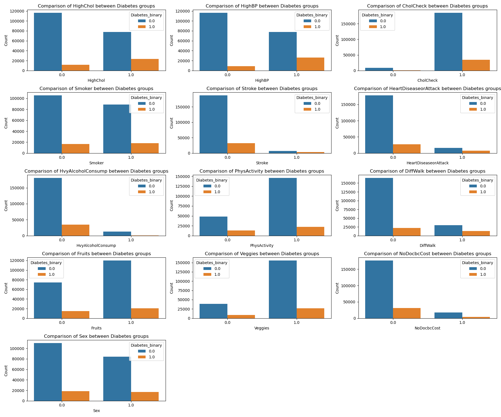
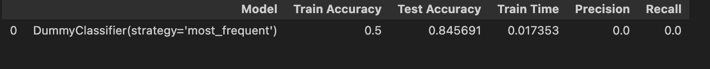
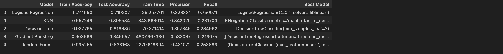

# Final Capstone Project

 **Change in the project:** 

Final capstone project has been changed since it was first proposed during first meeting with the TA. Initially, I was intended to do Recommendation system. However, one of the module was fully based on Recommendation system and most of the work I was planning to do was covered in the class module itself. 

Inorder to gain more experience in model building, I have opted for weight loss analysis. This project is directly related to the area of work as the current company.  I could use this learning to build better models in the existing Fitness app. However, data source (https://www.kaggle.com/datasets/arashnic/fitbit/data) contained very limited data and models were not really predictable. Inorder for better accuracy, it needed additional data. 

Finally, ended up with Health Analysis. This project was related to the health industry and the data source had good amount of data for the model building. 


**Why this Research is important:** 

Diabetes is among the most prevalent chronic diseases in the United States, impacting millions of Americans each year and exerting a significant financial burden on the economy. Diabetes is a serious chronic disease in which individuals lose the ability to effectively regulate levels of glucose in the blood, and can lead to reduced quality of life and life expectancy. After different foods are broken down into sugars during digestion, the sugars are then released into the bloodstream. This signals the pancreas to release insulin. Insulin helps enable cells within the body to use those sugars in the bloodstream for energy. Diabetes is generally characterized by either the body not making enough insulin or being unable to use the insulin that is made as effectively as needed.

Complications like heart disease, vision loss, lower-limb amputation, and kidney disease are associated with chronically high levels of sugar remaining in the bloodstream for those with diabetes. While there is no cure for diabetes, strategies like losing weight, eating healthily, being active, and receiving medical treatments can mitigate the harms of this disease in many patients. Early diagnosis can lead to lifestyle changes and more effective treatment, making predictive models for diabetes risk important tools for public and public health officials.

The scale of this problem is also important to recognize. The Centers for Disease Control and Prevention has indicated that as of 2018, 34.2 million Americans have diabetes and 88 million have prediabetes. Furthermore, the CDC estimates that 1 in 5 diabetics, and roughly 8 in 10 prediabetics are unaware of their risk. While there are different types of diabetes, type II diabetes is the most common form and its prevalence varies by age, education, income, location, race, and other social determinants of health. Much of the burden of the disease falls on those of lower socioeconomic status as well. Diabetes also places a massive burden on the economy, with diagnosed diabetes costs of roughly $327 billion dollars and total costs with undiagnosed diabetes and prediabetes approaching $400 billion dollars annually.

 **Research question:** 

Explore some of the following research questions:

- Can we provide accurate predictions of whether an individual has diabetes?
- What risk factors are most predictive of diabetes risk?
- Can we use a subset of the risk factors to accurately predict whether an individual has diabetes?


**Data Sources:**

Dataset used in this EDA is from UC Irvine Machine Learning Repository which can be accessed from this link: https://archive.ics.uci.edu/dataset/891/cdc+diabetes+health+indicators


 **URL for the assignment:** 
```
https://github.com/hegdesan-us/final_project.git
```
 **URL for solution Jupyter notebook:** 
```
https://github.com/hegdesan-us/final_project/blob/974831496ba529572c964c566717a44e242242cc/Final_Capstone.ipynb
```

**Name :** Sanjay Hegde \
**Couse :** UCB AI/ML 

**Directory :** Images \
  Description : Contains the images needed for the prompt questions and the Jupyter notebook 

**Directory : data** \
 Description : Contains the data file needed for the class project\
 diabetes _ 012 _ health _ indicators _ BRFSS2015.csv is a clean dataset of 253,680 survey responses to the CDC's BRFSS2015. The target variable Diabetes_012 has 3 classes. 0 is for no diabetes or only during pregnancy, 1 is for prediabetes, and 2 is for diabetes. There is class imbalance in this dataset. This dataset has 21 feature variables


### Data Preparation
 - No missing values found in the dataset

 


## Observation from Exploratory Data Analysis (EDA)

-   Data is cleaned, no null values, correct data types.
-   Dataset seems imbalanced and needs to be balanced
-   There were around 24K duplicate rows and it has been removed
-   No missing values

<h2> Visualizations</h2>

**Univariate Data Analysis**

 

**From univariate analysis**

- Looking at the sample size ( ~200K vs 25K), overall people with Diabetes vs non-diabetes is skewed data. Later, this needs appropriate scaling 
- HighBP, HighChol, Smoker and Sex columns are balanced data set
- DiffWalk, Anyhealthcare, HighAlcConsumption, Heartdesease, Stroke columns are skewed. Any conclusion from these data may not be conclusive.


**Bivariate Data Analysis**

 


 **Observation from the bivariate analysis**
- Individuals diagnosed with Diabetes exhibit a significantly greater incidence of hypertension compared to those without the condition
  -- Given the sample set ~24.8% non-high BP person having diabetes vs 75.2% high-BP individuals having diabetes
- Individuals diagnosed with Diabetes exhibit a significantly higher cholesterol compared to those without the condition
  -- Given the sample set ~33.1% non-high cholesterol person having diabetes vs 66.9% high-cholesterol individuals having diabetes
- Individuals with Veggie consumption more than one time per fay seems to have high volume of diabetes. This needs further data exploration
- Did not see significant correlation between alcohol consumption and diabetes. 
  -- Sample size is skewed towards non-alcoholic individuals ( > 15000 samples for non-alcoholic vs < 5000 alcoholics)
- Cholesterol check from past 5 years identified patients with Diabetes. This could be a  good information for preventive diagnosis
- There is no significant correlation with Sex or smoker
  -- Very small difference ( 51.9% vs 48.1%) difference in individuals with diabetes who smoke vs non-smokers
- There is ~75% Non-diabetic for the individuals with Physical Activity vs 28% non-diabetic. This is an amazing correlation.
  -- This data aligns with Diffwalk. People with difficulty in climbing stairs has high percentage od diabetes ( 37%) vs 62% for individuals without difficulty in walking.


**Correlation Heatmap**


**Observation from the heatmap**

Following few features has high Correlation

- Gen Health
- HighBP
- DiffWalk
- HihgChol

Following features has low correlation

- Fruits
- Veggies
- MentHlth
- Sex

Random Observations

- Education and Income are highly correlated with each other
- DiffWalk and PhysHlth are high correlated with each other
- HighBP and Age are correlated with each other

 
## Major features for the Machine Learning Models SelectKBest feature selection
**Observation** 
- Feature selection based on Lasso gives following top features. Considering Lasso just zeros columns not important, I have decided to use Ridge
  - ['HighBP', 'GenHlth', 'HighChol', 'Age', 'BMI']
- Feature selection based on Ridge gives following top features. I have opted with Ridge feature selection.
  - ['GenHlth', 'HighBP', 'BMI', 'Age', 'HighChol', 'HvyAlcoholConsump','CholCheck', 'Sex', 'Income', 'PhysHlth']


## Baseline performance measurement
Determine the baseline performance using Dummy Classifier. 

**Observation** Baseline performance using Dummy Classifier  has ~50% test and 84% train with 0 precision and accuracy. This means, model is completely un-reliable at this time. 



## Model performance comparison
Now, we aim to compare the performance of the Dummy Classifier with Logistic Regression model ,  KNN algorithm, Decision Tree, and Gradient Boost models.  Using the default settings for each of the models, fit and score each.  

**Observation** Random Forest Model showed ~82% test accuracy with 0.24 recall compared to other models.  


 

## Model performance comparison after Hyper Parameter Tuning
precision focuses on minimizing false positives (incorrectly identifying a healthy individual as having a condition), while recall prioritizes identifying all actual cases (minimizing false negatives, or missing real cases). For this analysis, we focus on precision. 

**Observation ( Using Lasso )** 

KNN seems to show ~82% test accuracy with low recall rate of 0.24. Gradient Boosting has significantly high recall rate which could be problematic in this analysis considering we are working with health data.   


**Observation ( Using Ridge )** 
Gradient Boosting seems to show ~84% test accuracy with low recall rate of 0.21 and the precision 0.53. However, it is computationally intensive. 





## Summary of research questions

**Can we provide accurate predictions of whether an individual has diabetes?**

From the data provided above and the model, with 80-85% accuracy that we can provide prediction of diabetes. Recall rate seems still high needs more parameter tuning to improve the recall rate.

**What risk factors are most predictive of diabetes risk?**

Considering Lasso and Ridge based feature selection both has similar accuracy and precision, we could just use following features from Lasso for model building.
HighBP', 'GenHlth', 'HighChol', 'Age', 'BMI' are the risk factors are most predictive of diabetes risk

**Can we use a subset of the risk factors to accurately predict whether an individual has diabetes?**

Yes. as given above we can predict diabetes with subset of factors


## Next steps

- Additional research can be done on the Income and socio economic data. This seems like unexplored area of research on health
- More data collection on Individuals with Alcohol consumption vs non-alcohol would help determine if there is any correlation to diabetes
- Subset of risk factors mentioned above can be determined to predict diabetes. This can be integrated into fitness app for educating individuals


 

 
